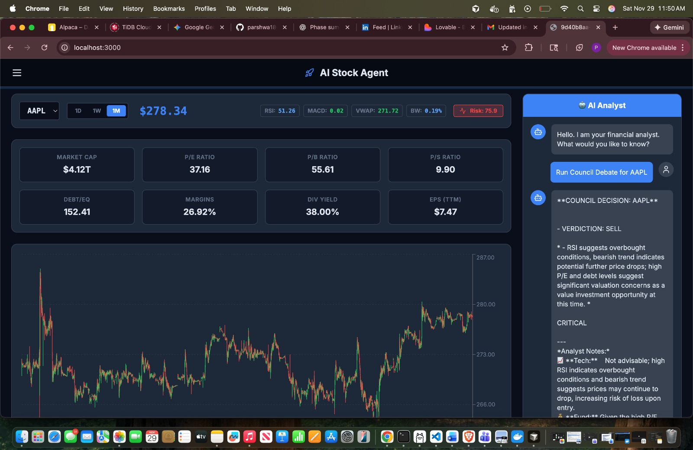
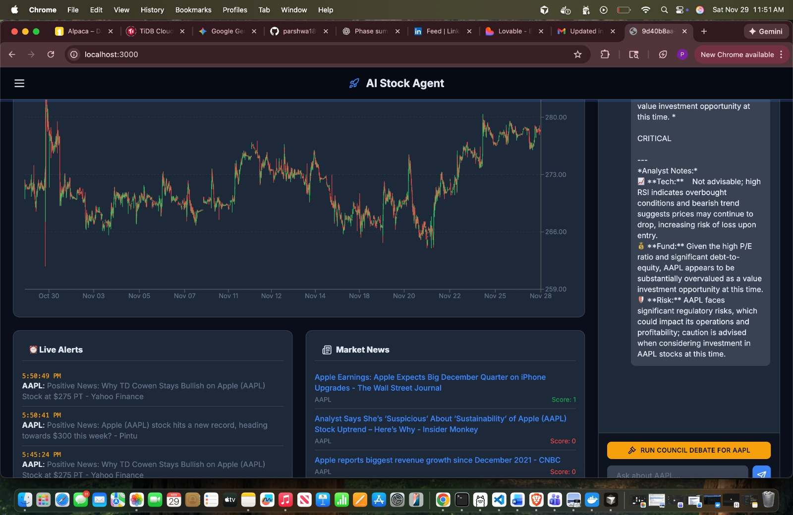

# 📈 Live Stock Analysis Agent & Agentic RAG

## 1. Project Objective

This project is a modern **Financial AI Platform** that acts as an autonomous 
market analyst. It moves beyond simple scripts into a **containerized 
microservices architecture**, combining real-time data ingestion with an AI 
"Council" that debates investment theses.

It uses an **Event-Driven Architecture** where a central API handles user 
requests while background workers asynchronously process massive amounts of 
financial data.

---

## 2. Project Preview

| **Live Dashboard & Financial Metrics** | **AI Analyst & Council Debate** |
|:---:|:---:|
|  |  |

---

## 3. System Architecture

The system is split into **three distinct layers**, decoupled to ensure 
scalability and speed.

### 🏛️ High-Level Architecture

The following diagram illustrates how the React Frontend, FastAPI Backend, and 
Python Workers interact with the TiDB Cloud Database and Local AI.

```mermaid
graph TD
    subgraph Client_Side [Frontend Client]
        UI[React / Vite App]
    end

    subgraph Backend_Services [Backend Containers]
        API[FastAPI Server]
        Worker[RQ Worker Process]
        Redis[(Redis Cache)]
    end

    subgraph Data_Layer [Storage & External]
        TiDB[(TiDB Cloud MySQL)]
        FAISS[(Local Vector DB)]
        Ollama[Ollama / Local LLM]
        Alpaca[Alpaca / Yahoo API]
    end

    UI -->|HTTP Requests| API
    API -->|Read Data| TiDB
    API -->|RAG Search| FAISS
    API -->|Chat Prompt| Ollama
    
    API -.->|Schedule Job| Redis
    Redis -.->|Pick Job| Worker
    
    Worker -->|Fetch Data| Alpaca
    Worker -->|Write Data| TiDB
    Worker -->|Write Embeddings| FAISS
